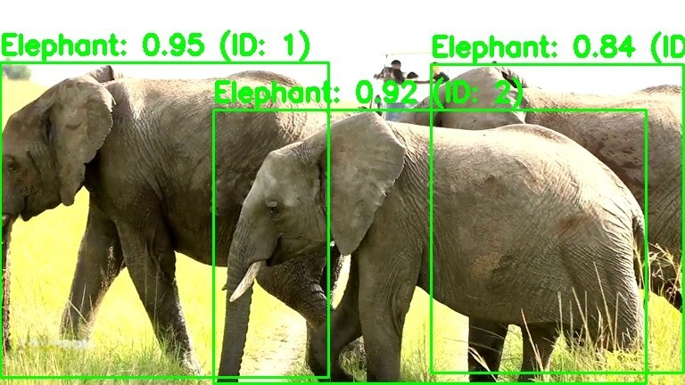
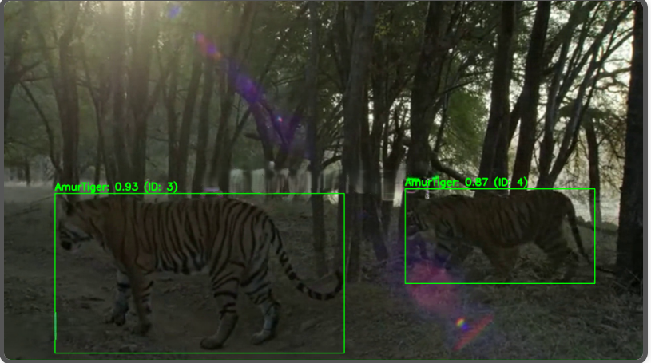

# Real-Time Wildlife Tracking and Detection Using YOLO11 and BotSORT with Thermal Imaging

### Demo 
  
**Caption:** Real-time thermal wildlife detection and tracking. An elephant is detected, assigned a unique ID, and tracked across frames, demonstrating the system’s continuous monitoring and alert generation.

---

## 🌟 Project Objective
Automated real-time detection and tracking of wildlife at urban–forest boundaries to mitigate human-wildlife conflicts.  
This system leverages thermal imaging and advanced object detection to assist forest officials with timely alerts for effective intervention and improved public safety.

---

## 🔍 Problem Statement
Increasing human-wildlife conflicts in urban-fringe areas pose a threat to both human safety and wildlife conservation. Manual monitoring is inefficient and often too slow to prevent incidents.

---

## 💡 Solution Approach
An end-to-end solution combining:
- **Thermal Image Processing** for effective detection in low-light conditions.
- **YOLO11-based Object Detection** (fine-tuned on a custom wildlife thermal dataset).
- **BotSORT Tracking Algorithm** for robust multi-object tracking and unique ID assignment.
- Flask-based Web Application to display real-time video streams and notifications.

Upon detecting an animal, the system generates timestamped alerts with snapshots, displayed in a notification inbox for forest officials.

---

## ⚡ Key Features
- Real-time detection of 4 wildlife classes: **Tiger, Elephant, Leopard, Black Bear**
- Unique ID assignment and continuous tracking of individual animals
- Automatic generation of timestamped notification images
- Web-based interface for video streaming and alert viewing

---

## 🛠️ In-Depth Tech Specs
- **Detection Model**:  
  YOLO11 (Ultralytics) fine-tuned on a custom thermal wildlife dataset collected from various public sources.

- **Tracking Algorithm**:  
  BotSORT (more robust and accurate than DeepSORT in thermal scenarios).

- **Web Framework**:  
  Flask for front-end display of video streams and notifications.

- **Storage**:  
  In-memory store for detected animals during processing.

- **Notification System**:  
  Generates and stores unique snapshot images in `static/notifications` directory.

---

## 📊 Performance Metrics (Epoch 100)
| Metric | Value |
| :----- | :---- |
| Training Box Loss | ~0.4 |
| Training Classification Loss | ~0.45 |
| Training Distribution Focal Loss | ~0.85 |
| Validation Box Loss | ~0.8 |
| Validation Classification Loss | ~0.45 |
| Validation Distribution Focal Loss | ~1.3 |
| Precision | ~90% (How many detected animals were correct) |
| Recall | ~90% (How many actual animals were detected) |
| mAP50 (Mean Average Precision at 50% IOU) | ~95% |
| mAP50-95 | ~80% |

---

## 🎥 Demo / Visuals

### Upload Page
  
**Caption:** Upload page where users can submit videos for detection.

### Sample Notifications
  
**Caption:** Elephant detected for the first time with unique ID assigned.

  
**Caption:** Elephant tracked across consecutive frames, showing continuous monitoring.

  
**Caption:** Leopard successfully identified and captured in thermal imaging with timestamped alert.

  
**Caption:** Tiger detected and tracked with bounding box and unique ID.

---

## 📁 Dataset & Credits
- **Custom Thermal Wildlife Dataset**:  
  Collected from various public thermal animal datasets (specific sources to be cited later).

- **Pre-trained YOLO11 Weights**:  
  [https://docs.ultralytics.com/models/yolo11/](https://docs.ultralytics.com/models/yolo11/)

---

## 📊 Future Work
- Full deployment as a cloud-based web service.
- Expand dataset for improved accuracy and support for additional animal classes.
